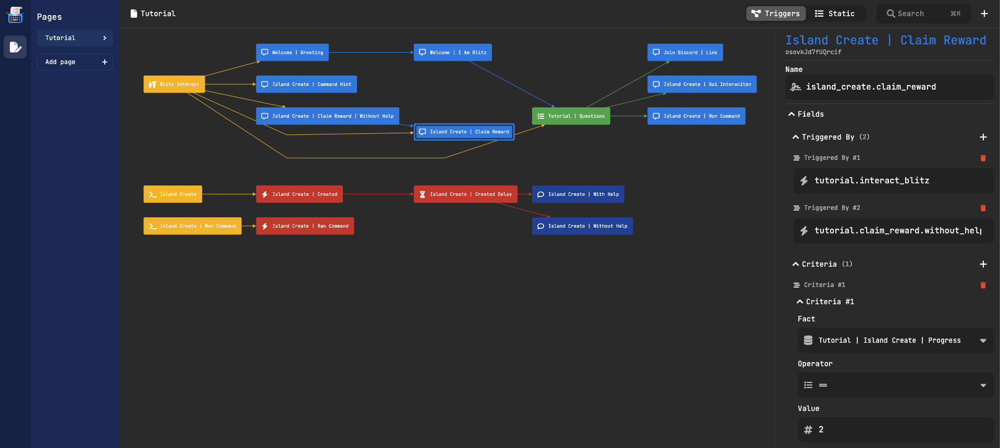

# Typewriter

###### The next generation of questing in minecraft.

Typewriter is a plugin for spigot Minecraft servers that allows for custom player interactions such as quests,
NPC chat, Create branching story with ease, and more. It is easily configurable using the visual interface specifically
designed for this plugin.
The plugin can also be extended using adapters, which are [pre-made](#pre-made-adapters) or can be custom-made by developers.

To get started with Typewriter, see the [Getting Started](#getting-started) section.

A dialogue sequence with Typewriter where the player is asked to choose between multiple options.

The visual interface for Typewriter, where you can create quests, NPCs, and more.

### Features

- Create custom player interactions, including quests and NPC chat, branching story, and more...
- Configure interactions using a custom written visual interface
- Extend the plugin using adapters
- [Pre-made adapters](#pre-made-adapters) available for SuperiorSkyblock2 and Citizens, and more coming soon
- Custom adapters can be made by developers
- Contribute custom adapters to the plugin repository through pull requests

## Getting started

To get started with Typewriter, simply download the [plugin]() and accompanying [configurator]().
Then, use the app to configure your custom interactions as desired.

You can also utilize the [pre-made adapters](#pre-made-adapters) or create your own custom adapters to extend the
capabilities of the plugin.

## For administrators

As an administrator, you can easily configure Typewriter using the custom app. Simply input your desired interactions
and let the plugin handle the rest. You can also take advantage of the pre-made adapters or create your own custom
adapters to further customize the plugin for your server.

## For developers

Are you a developer looking to contribute to Typewriter? We welcome any custom adapters you may create! Simply make a
pull request to add your adapter to our repository. If you create an adapter for an open source plugin, we would be
happy to include it in our list of ready adapters. Help us make Typewriter the best it can be!

## Pre-made adapters

| Adapter Name      | Description                             | Download Link                |
|-------------------|-----------------------------------------|------------------------------|
| SuperiorSkyblock2 | A a modern Skyblock core                | [Download](link_to_download) |
| Citizens          | A plugin for adding NPCs to your server | [Download](link_to_download) |

## License
GNU General Public License v3.0

See [LICENSE](LICENSE) to see the full text.

# Credits

- [Aarthificial](https://www.youtube.com/channel/UCZ1XWgQK8YkZp5ZwXKdVqjw) For the inspiration on the base logic.

