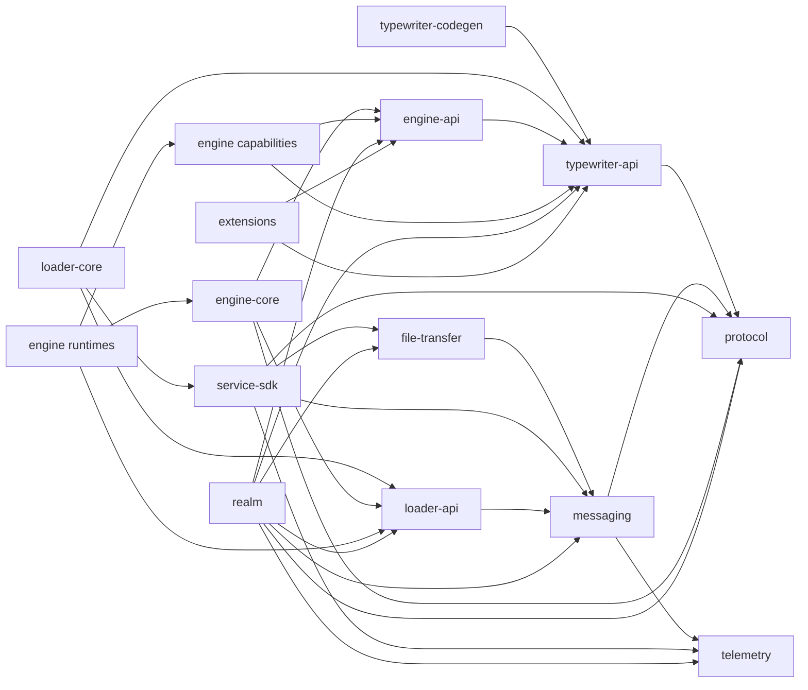

# Services architecture consolidation plan

Status: implemented and verified on 2026-08-29.

Branch at approval: `features/runtime-service-scaffold`.

This document is the implementation contract for simplifying `services/`. If evidence invalidates a decision below, stop implementation, research the conflict, and submit a revised plan before changing direction.

## Implemented result

The services graph now contains twenty three normal projects instead of sixty seven. Only `build-logic` and `imprint` remain included builds.

Canonical implemented project paths are:

```text
:protocol
:typewriter-api
:typewriter-codegen
:service-sdk
:messaging
:file-transfer
:telemetry
:internal-utils
:loader-api
:loader-core
:loader-standalone
:loader-paper
:loader-distribution
:engine-api
:engine-core
:engine-minecraft
:engine-conformance-base
:engine-conformance-composite
:engine-panel
:engine-paper
:engine-conformance
:realm
:conformance-extension
```

`internal-utils` is retained because retry policy, exceptional throwable handling, coroutine delay, and future awaiting remain shared by multiple cohesive owners. Confirmed unused providers and the unused string extension were removed.

## Objective

Replace accidental build and module fragmentation with a small, explicit, acyclic architecture that can remain understandable for decades.

The result must provide:

- One normal Gradle build rooted at `services/`.

- Stable public APIs for third party Typewriter extensions.

- A turnkey Kotlin and Java SDK for independently deployed Typewriter services.

- One canonical code generation pipeline for Realm, engine core, engine runtimes, engine capabilities, and extensions.

- Clear separation between compile dependencies, build plugins, generated metadata, runtime loading, and deployment artifacts.

- Fewer projects, wrappers, settings files, coordinates, configuration sites, and navigation steps.

## Current problems

The approved audit found:

- Twenty one nested included builds under `services/`.

- Sixty seven explicitly checked Gradle projects.

- Eight Gradle wrappers.

- A handwritten composite inventory required to run service wide verification.

- Numerous projects with zero, one, or two handwritten source files.

- Empty testing projects and an empty `engine-codegen` project.

- Generated Skir contracts for every protocol domain incorrectly owned by `service-communicator-skir`.

- Roughly 139,000 generated Kotlin lines mixed into communication infrastructure.

- Five code generation artifacts that are always consumed as one processor suite.

- Seven public authoring artifacts that extension projects always consume together.

- A working Registrar service lifecycle and a separate unused integration identity scaffold.

- Repeated adapter, Koin, configuration, and testing modules that do not represent independently selectable deployments.

## Approved decisions

### Gradle topology

All normal service projects belong to one Gradle multiproject build rooted at `services/`.

Two included builds remain:

- `build-logic`, because it configures Gradle projects and settings.

- `imprint`, because it supplies the Gradle plugin required while normal projects are configured.

No other project remains a nested Gradle root without a newly approved reason.

### Public Typewriter API

The shared authoring and runtime programming model is named `typewriter-api`, not `extension-sdk`.

`typewriter-api` is used by:

- Realm.

- Engine core.

- Engine runtimes.

- Engine capabilities.

- First party extensions.

- Third party extensions.

It owns the shared Typewriter vocabulary, including type declarations, elements, pages, presentations, Realm capabilities, discovery contracts, and related authoring contracts.

Third party extension repositories declare one intentional public API dependency. They do not declare the current internal graph of type, discovery, element, library, page, presentation, and capability artifacts.

### Code generation

The canonical processor artifact is named `typewriter-codegen`.

It contains all Typewriter KSP processors and shared processor infrastructure. It is not extension specific.

Every project that declares an Imprint artifact automatically receives `typewriter-codegen`. This includes:

- Realm artifacts.

- Engine core artifacts.

- Engine runtime artifacts.

- Engine capability artifacts.

- Extension artifacts and their source parts.

Imprint supplies at least these processor options:

```text
typewriter.artifactId
typewriter.sourcePart
```

Processors emit portable contributions. Contribution metadata determines whether Realm discovery, execution discovery, or both consume a declaration.

The following invariant is mandatory:

```text
Every Imprint artifact receives the canonical Typewriter processor suite automatically.
```

Manual processor lists in individual engine or extension build files must disappear.

### Generated protocol ownership

Generated Kotlin Skir contracts move into a project named `protocol`.

`skir.yml` becomes the source of truth for the new generated output path. Generated files are never moved or edited independently of generator configuration.

The handwritten Skir payload adapter moves to messaging. Domain and runtime code depend on `protocol`, not on an artifact named after communication infrastructure.

### Public service SDK

The public service integration artifact is named `service-sdk`.

It is a supported Kotlin and Java SDK for third party services such as MCP servers, Discord bots, and other independently deployed integrations.

Loader and third party services use the same registered service identity and lifecycle. There is no separate integration identity system.

`service-sdk` owns the cohesive developer workflow for:

- Service identity issuance.

- Durable credentials.

- Organization binding.

- Authentication.

- Messaging connection and reconnection.

- Status and lifecycle reporting.

- Safe shutdown.

- Optional assignment to at most one Realm per running service instance.

The current `service-integration-sdk` identity, credential, registration, permission, gateway, registry, and messaging scaffold has no production consumer. It must not remain as a parallel model.

Realm assignment is not currently implemented by the working Registrar contract. Consolidation must not fabricate that behavior. Adding a real Realm assignment workflow requires an explicit vertical slice through Skir, backend, SDK, authorization, and tests. Until that slice is approved and implemented, the SDK must state the missing capability honestly.

### Adapter policy

Supported installations do not select alternative NATS, HTTP, file storage, telemetry, or dependency injection implementations.

Useful interfaces and test fakes remain where they isolate vendor APIs, effects, or lifecycle behavior. Separate Gradle projects and JARs are not retained merely because an interface exists.

A new implementation can justify a new artifact when a real deployment, publication, classpath, or compatibility boundary appears.

### Compatibility

No external repository currently consumes the new `services` Gradle artifact coordinates.

This migration makes a clean break. Do not create compatibility publications for obsolete coordinates such as the current granular domain, Registrar, or integration SDK artifacts.

### Service scope

One third party service identity binds to one organization and may have zero or one active Realm assignment.

Multiple concurrent Realm assignments are outside the approved model. Supporting them would require Realm scoped sessions, authorization, routing, lifecycle, and isolation throughout the SDK and backend.

## Target project structure

The intended structure is:

```text
services/
    settings.gradle.kts
    build.gradle.kts
    gradlew
    gradlew.bat
    gradle/
    build-logic/
    imprint/
    protocol/
    sdk/
        typewriter-api/
        typewriter-codegen/
        service-sdk/
    platform/
        messaging/
        file-transfer/
        telemetry/
    runtime/
        loader/
            api/
            core/
            standalone/
            paper/
            distribution/
        engine/
            api/
            core/
            capabilities/
            runtimes/
        realm/
    extensions/
        conformance/
```

Exact directories may change when source evidence reveals a clearer cohesive owner. The approved concepts and dependency rules may not change without a revised plan.

## Dependency rules

Arrows below mean that the source project depends on the target project.



The compile dependency direction is:

```text
runtime implementations
    to public contracts
    to protocol
```

Public contracts never depend on runtime implementations.

Loader does not compile against Realm or concrete engine artifacts. It discovers and loads them at runtime through `loader-api` and Imprint manifests.

## Generated contribution rules

Code generation availability and runtime activation are separate.

Realm, engine core, engine runtimes, engine capabilities, and extensions may all declare supported annotations. For example, they may declare types or presentations when those declarations belong to the artifact.

Generated outputs must identify their discovery domain:

- Types may contribute to Realm discovery, execution discovery, or both.

- Presentations contribute to Realm discovery.

- Realm capabilities contribute to Realm discovery.

- Element metadata may contribute to Realm discovery and execution discovery.

- Runtime facets contribute to execution discovery.

Realm directed generated providers must not reference engine only classes. Execution directed generated providers must not depend on Realm implementation classes.

Capability metadata must remain inspectable by Realm without executing engine capability behavior.

## Boundaries that remain separate

### Loader

Keep these Loader projects separate:

- `loader-api` for the hosted runtime contract.

- `loader-core` for platform neutral orchestration.

- `loader-standalone` for terminal and command line dependencies.

- `loader-paper` for Paper dependencies.

- `loader-distribution` for the combined distributable JAR.

These projects enforce real classpath rules. Do not replace them with custom source sets. Custom source sets would reproduce the same dependency graph through more obscure build configuration.

### Engine

Keep separate engine projects when they produce distinct runtime artifacts, capability artifacts, manifests, or classpaths.

Manifest only engine runtimes and capabilities may contain little or no Kotlin source while still representing real deployable identities. Their small size does not make them accidental.

Delete `engine-codegen` because it is empty and does not represent a processor or artifact boundary.

### Realm

Realm remains one cohesive deployable project unless later evidence demonstrates an independently changing, testable, and reusable boundary.

Do not split Realm by repository, route, schema, compiler, or deployment layer merely to create symmetry.

### Imprint

Imprint remains an included plugin build. It owns artifact declarations, source parts, code generation context, relationships, contribution assembly, deterministic manifests, and artifact packaging.

Imprint does not own Typewriter domain processors. Those belong to `typewriter-codegen`.

## Planned removals and consolidations

Confirmed candidates include:

- Nested service settings files.

- Redundant nested Gradle wrappers.

- Empty root aggregation projects made unnecessary by the main build.

- Empty page testing project.

- Empty presentation testing project.

- Empty Realm capability testing project.

- Empty `engine-codegen` project.

- Manual processor dependency lists.

- The unused parallel integration identity model.

- Unused `DeferredProvider`.

- Unused `StateProvider`.

- Unused string extension.

- Duplicate Loader and Realm property loading mechanics.

- Tiny Koin projects that only assemble the one supported runtime stack.

- Placeholder internal versions where no publication exists.

Every deletion must be reverified immediately before execution. New usage discovered during implementation changes a confirmed removal into an investigation question.

## Implementation phases

### Phase 1: establish the single Gradle build

Goal: remove composite build sprawl without moving Kotlin sources or changing runtime behavior.

Steps:

1. Record the current project graph, verification tasks, artifact outputs, manifests, distribution contents, and worktree state.

2. Promote one Gradle wrapper to `services/`.

3. Declare all normal projects in `services/settings.gradle.kts`.

4. Preserve `build-logic` and `imprint` as included builds.

5. Replace cross build coordinates with direct project dependencies.

6. Replace handwritten included build task aggregation with normal multiproject lifecycle tasks.

7. Remove obsolete nested settings files and wrappers.

8. Remove empty root aggregation projects when their tasks have moved to an explicit owner.

9. Verify behavior and artifact semantics before beginning Phase 2.

Completion requires one understandable Gradle project graph and green service wide verification.

### Phase 2: correct protocol ownership

Goal: make generated contracts a first class protocol boundary.

Steps:

1. Create `protocol`.

2. Change the Kotlin output path in `skir.yml`.

3. Regenerate Kotlin output from Skir declarations.

4. Move the handwritten payload adapter into messaging.

5. Replace `service-communicator-skir` dependencies with `protocol` or messaging dependencies according to actual usage.

6. Delete the obsolete generated project only after all consumers compile.

Completion requires deterministic Kotlin, Dart, and Rust generation with no handwritten generated file edits.

### Phase 3: create `typewriter-api` and `typewriter-codegen`

Goal: provide one public Typewriter programming model and one canonical processor suite.

Steps:

1. Create `typewriter-api`.

2. Move shared type, discovery, element, library, page, presentation, and Realm capability contracts into it while preserving public Kotlin packages where useful.

3. Create `typewriter-codegen`.

4. Merge the Typewriter type, registrar, element, page, presentation, and Realm capability processors.

5. Consolidate shared KSP annotation parsing, context validation, contribution writing, and generated module construction where the policy is genuinely identical.

6. Configure every Imprint artifact project to receive the processor suite automatically.

7. Remove manual processor lists.

8. Update Realm, engine, capability, and extension consumers.

9. Remove obsolete domain and processor projects.

10. Add conformance coverage proving declarations work from Realm, engine core, engine runtime, engine capability, and extension projects.

Completion requires a single public API coordinate and a single processor coordinate without weakening discovery domain isolation.

### Phase 4: create `service-sdk`

Goal: provide one real public service lifecycle instead of two competing models.

Steps:

1. Define the smallest public SDK entrypoint around the working Registrar lifecycle.

2. Move service identity, credentials, registration, organization binding, connection, status, and shutdown behavior behind that entrypoint.

3. Consolidate the supported NATS, HTTP, credential storage, telemetry, and composition defaults.

4. Keep interfaces where they isolate effects, vendor APIs, or deterministic tests.

5. Make Loader consume the same SDK surface available to third party services.

6. Remove the unused integration identity scaffold.

7. Document the missing Realm assignment vertical slice rather than simulating it.

Completion requires one service identity model, one lifecycle, one public SDK, and preserved Loader behavior.

### Phase 5: collapse remaining accidental modules

Goal: remove residue after primary ownership boundaries are stable.

Steps:

1. Consolidate messaging projects that do not represent distinct public or classpath boundaries.

2. Consolidate file transfer core, supported adapters, and tests into the smallest cohesive project set.

3. Consolidate telemetry core, supported console behavior, and tests while keeping API and SDK dependency direction safe.

4. Remove Koin specific projects where composition belongs to an application owner.

5. Remove confirmed dead utilities and empty projects.

6. Centralize shared configuration source precedence and file loading without centralizing application specific settings.

7. Rename packages and projects that still describe obsolete mechanisms or ownership.

8. Update `services/DEVELOPMENT.md`, contribution guidance, commit scopes, CI, Dagger tasks, and generator paths.

9. Add a structural check that rejects unapproved nested Gradle roots and forbidden project dependencies.

Completion requires no known accidental project boundary from the audit.

## Verification contract

### Before each phase

- Inspect `git status` and preserve unrelated work.

- Record the current commit and relevant generated state.

- Reverify every planned deletion and rename.

- Run the narrow baseline that proves behavior affected by the phase.

### Quick verification

Use focused compilation and tests for touched projects, plus:

```shell
git diff --check
```

### Thorough service verification

The implemented final commands are:

```shell
services/gradlew check --console=plain
services/gradlew ktlintCheck --console=plain
services/gradlew assembleDevelopmentArtifacts :loader-distribution:verifyDistribution --console=plain
services/gradlew :conformance-extension:test --console=plain
bunx --no-install skir format --ci
bunx --no-install skir gen
git diff --check
```

All commands passed. The full service check completed 252 tasks, with 53 executed and 199 up to date. The final focused telemetry check completed 29 tasks after the obsolete internal context label was renamed.

### Required semantic evidence

Final success requires more than compilation:

- The Loader distribution contains standalone and Paper entrypoints.

- Realm remains a loader managed artifact without a direct process entrypoint.

- Engine and capability artifact manifests retain their identities, versions, relationships, and host API constraints.

- The conformance extension retains every declared source part and capability relationship.

- Realm discovery loads Realm contributions only.

- Execution discovery loads execution contributions only.

- Types and presentations declared in each approved artifact kind appear in the expected generated manifest.

- Generated protocol output matches `skir.yml` and the Skir declarations.

- No external publication exposes obsolete internal coordinates.

## Non goals

This consolidation does not by itself:

- Complete the authored content to Paper player vertical slice.

- Implement production Realm assignment for third party services.

- Add alternative transports, storage providers, telemetry backends, or dependency injection systems.

- Change persisted Realm schema or content semantics.

- Redesign Skir protocols unless required for an explicitly approved SDK behavior.

- Modify legacy `engine/`, `extensions/`, `module-plugin/`, or `app/` directories.

- Modify generated `docs/adapters/` content.

## Change discipline

Each phase is a separate coherent change set. Do not mix broad formatting, unrelated cleanup, protocol redesign, backend behavior, or generated snapshot churn into structural moves.

Commit, push, cleanup, deletion outside the approved targets, and external publication remain separate actions requiring their own authorization.
