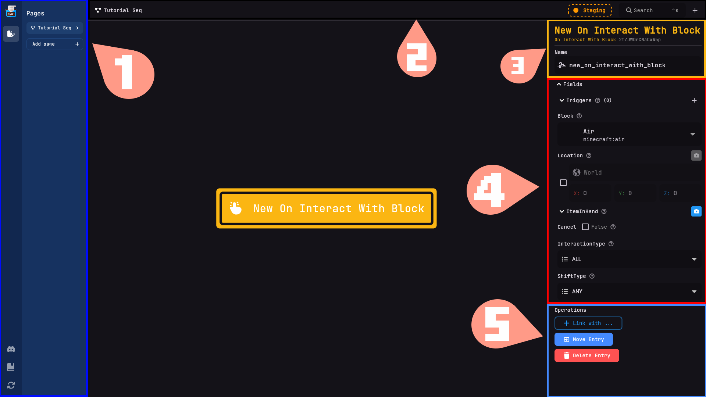
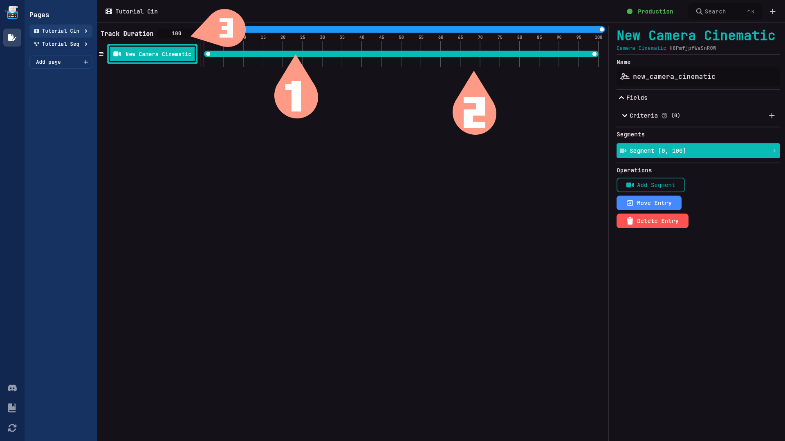

import Player from "@site/src/components/Player";

# Layout

On this page you will learn how to use the TypeWriter Webpanel and create certain things.

## Creating a page.

To create a page simply click the button `Add Page` then enter the name of the page(It can't be a duplicate name of an already existing page.) and select one of the 4 types: `Sequence`,`Static`, `Cinematic`,  `Manifest`.

<Player url={require("../assets/layout/add-page.webm").default} />

Now that we have created a sequence page i will explain how the different layouts works.
## Base Layout

<ol>
  <li num>
    **Pagelist**: This is where you can see all the pages that you have created.
    You can also create new pages here.
  </li>
  <li>
    **Actionbar**: There are multiple actions that you can perform by clicking
    on the buttons from left to right:
  </li>
  <ul>
    <li>
      **Staging Indicator**: Indicates staging changes. Orange means changes are
      not active on the server, while green means changes are active on the
      server.
    </li>
    <li>**Searchbar**: Use this to search for entries or create new ones.</li>
    <li>**+ button**: Click here to create new entries.</li>
  </ul>
  <li value="345">
    **Inspector**: This is where you can edit the properties of the selected
    entry.
  </li>
  <ul>
    <li>
      **Entry Information**: Here you can view all the information about an
      entry, such as the ID and name.
    </li>
    <li>**Fields**: Use this section to edit the properties of the entries.</li>
    <li>
      **Operations**: This section contains various actions that you can perform
      with the entry.
    </li>
  </ul>
</ol>
## Sequence, static and manifest layout
* In the center are all your entries shown. 
* Use your mouses scrollwheel to zoom in or out 
* Click on an entry to open it in the inspector.
## Cinematic layout

1. **Segments**: Inside a cinematic entry you can create segments these than are displayed on your track. Segments can't overlap eachother.
2. **Track**: This is where you can see all the segments that you have created and edit their show duration.
3. **Track Duration**: Here you can edit the duration of the track. The track duration is in Minecraft ticks so 20 ticks equals 1 second.
