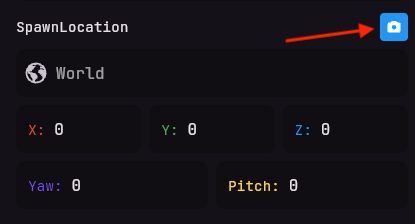

# Setting the entity's position and rotation
Next, you can set the position and rotation of the entity.
You can do this by entering the coordinates in the `Position` and `Rotation` fields.
We want the NPC to spawn at certain coordinates,
you can either enter the coordinates manually or use the `Capture Position` button
to synchronize the NPC to your current position and rotation in the game.

