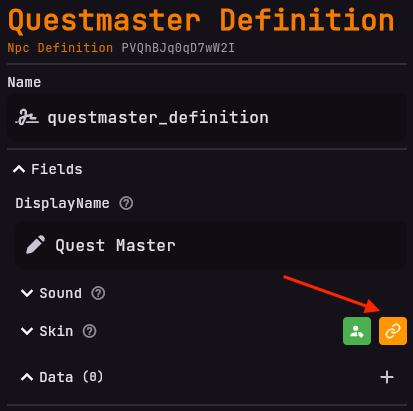
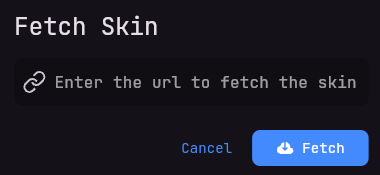

# Setting the entity's skin
Don't want to have the default skin?
No problem!
You can change the skin of the entity by navigating to the `Skin` field and selecting
a skin from either a valid skin link or enter a player's UUID from the buttons to the right of `Skin`.

