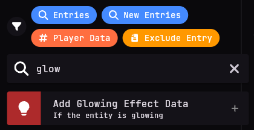
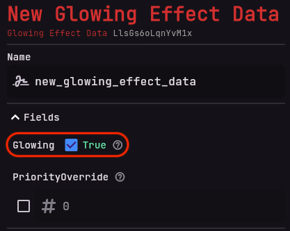
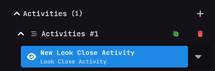

# Entity Adapter
Here you will learn about all the features of the Entity Adapter.

## What is the Entity Adapter?
The Entity Adapter is a feature that makes it easy to spawn, manage and control entities like NPCs on your server.

## Features

The Entity Adapter is very powerful and versatile and includes the following features:
- Defining an entity
- Spawning an entity at a specific location
- Changing an entity's name
- Setting an entity's skin
- Providing custom entity data
- Giving an entity an activity

## How to use the Entity Adapter
The Entity Adapter is very easy to use and only requires some basic knowledge to get started.

## Creating an entity
In order to use an entity, you first have to define it. This is done by creating a new definition of the type of entity you want to use and linking it with an instance. You can do this inside a **manifest** page.

### Creating a new entity definition
To create an entity definition, you have to create a manifest page and define the entity inside it. Here is an example of how to define an entity:

Start off by clicking **add page**. Here, choose the **Manifest** type in the dropdown menu and name the page whatever you want. In this example, we will name it `Customentity`.

Next, you have to define the entity. Click the `Add Entry` button or the `+` in the top right corner,
then search for `Add NPC Definition`, and add it to the page. You should now see the entry on your screen.

### Customizing the entity
Now that you have defined the entity, you can customize it to your liking.

#### Setting the entity's name
Let's rename the entry to `Questmaster Definition`.

We want him to have the name Quest Master in-game, so click on the DisplayName and name him `Quest Master` to give the entity a custom name.

#### Setting the entity's custom noises
If you want the NPC to emit custom noises, you can do that by using the `Sound` field. We won't touch this field in this example, but it will be explained further later on.

TODO:
REWRITE THE FOLLOWING:
Just enter the sound you want the entity to emit in the SoundId field, select if you want the sound to come from the NPC `self`, a custom emitter `emitter`, or a place on the map `location`.

#### Setting the entity's skin
Don't want to have the default skin? No problem! You can change the skin of the entity by navigating to the `Skin` field and selecting a skin from either a valid skin link or enter a player's UUID from the buttons to the right of `Skin`. We want the NPC to have a custom skin, so we will enter a valid skin link. Choose any you like.

#### Setting the entity's data
If you want to give the entity some custom data, you can do that by adding a data field and adding the data you want to link with the entity. You can add as many data fields as you want. In this example, we want to see the NPC from far away, so we will add a `Glowing Effect` data field and set it to `true` in the editor.

### Creating an entity instance
We have now defined the entity, but it is not yet spawned in the world. To spawn the entity, we have to add the `Entity Instance` component to the page.

First, select the npc definition you want to spawn from the `Definition` dropdown. In this case, we will select the `Questmaster Definition` we just created. This will act as a base for our NPC instance

#### Customizing the entity instance
In the entity instance component, you can set the entity's position, rotation, data and activities.

#### Setting the entity's position and rotation
Next, you can set the position and rotation of the entity. You can do this by entering the coordinates in the `Position` and `Rotation` fields. We want the NPC to spawn at certain coordinates, you can either enter the coordinates manually or use the `Capture Position` button to synchronize the NPC to your current position and rotation in the game.

#### Setting the entity's data
You can also add data to the entity instance. This data is specific to that NPC instance and will not affect the definition, but only that instance. You can reuse entity definitions and their data across multiple instances.

#### Setting the entity's activities
Activities are currently limited to `fixed location` and `look at close players`. You can set the activity of the entity by selecting the activity you want from the `Activity` dropdown. We want the NPC to look at close players, so we will select `Add Look Close Activites`.

That's it! You have now created an entity definition and spawned an instance of it in the world. You can now see the NPC in-game with the custom name, skin and data you provided. It should also look at you when you are nearby.

## Additional Information
The same principle applies to all other entities, such as **Cows** or **Villagers**. You can define and spawn any entity you want using the Entity Adapter, just make sure the type of your definition matches the type of the instance you want to spawn.
