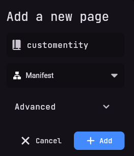
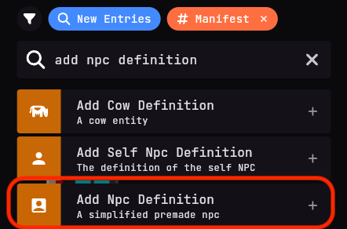
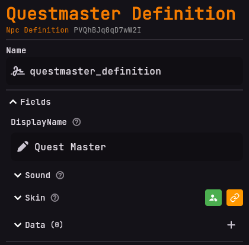
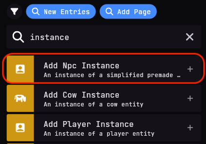
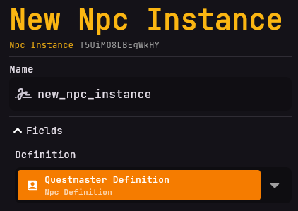

# Entity Adapter
Here you will learn about all the features of the Entity Adapter.

## What is the Entity Adapter?
The Entity Adapter is a feature that makes it easy to spawn, manage and control entities like NPCs on your server.

## Features

The Entity Adapter is very powerful and versatile and includes the following features:
- Defining an entity
- Spawning an entity at a specific location
- Changing an entity's name
- Setting an entity's skin
- Providing custom entity data
- Giving an entity an activity

## How to use the Entity Adapter
The Entity Adapter is very easy to use and only requires some basic knowledge to get started.

## Creating a simple entity
To use an entity, you first have to define it.
This is done by creating a new definition of the type of entity you want to use and linking it with an instance.
You can do this inside a **manifest** page.

### Creating a new entity definition
To create an entity definition, you have to create a manifest page and define the entity inside it. Here is an example of how to define an entity:

Start off by clicking **add page**.
Here, choose the **Manifest** type in the dropdown menu and name the page whatever you want.
In this example, we will name it `Customentity`.

Next, you have to define the entity. Click the `Add Entry` button or the `+` in the top right corner,
then search for `Add NPC Definition`, and add it to the page. You should now see the entry on your screen.

# Customizing the entity
Now that you have defined the entity, you can customize it to your liking.

## Setting the entity's name
Let's rename the entry to `Questmaster Definition`.

We want him to have the name Quest Master in-game, so click on the DisplayName and name him `Quest Master` to give the entity a custom name.

### Creating an entity instance
We have now defined the entity, but it is not yet spawned in the world. To spawn the entity, we have to add the `Entity Instance` component to the page.

First, select the npc definition you want to spawn from the `Definition` dropdown.
In this case, we will select the `Questmaster Definition`
we just created.
This will act as a base for our NPC instance

That's it!
You have now created an entity definition and spawned an instance of it in the world.
You can now see the NPC in-game with the custom name, skin and data you provided.
It should also look at you when you are nearby.

The same principle applies to all other entities, such as **Cows** or **Villagers**.
You can define and spawn any entity you want using the Entity Adapter, just make sure the type of your definition
matches the type of the instance you want to spawn.