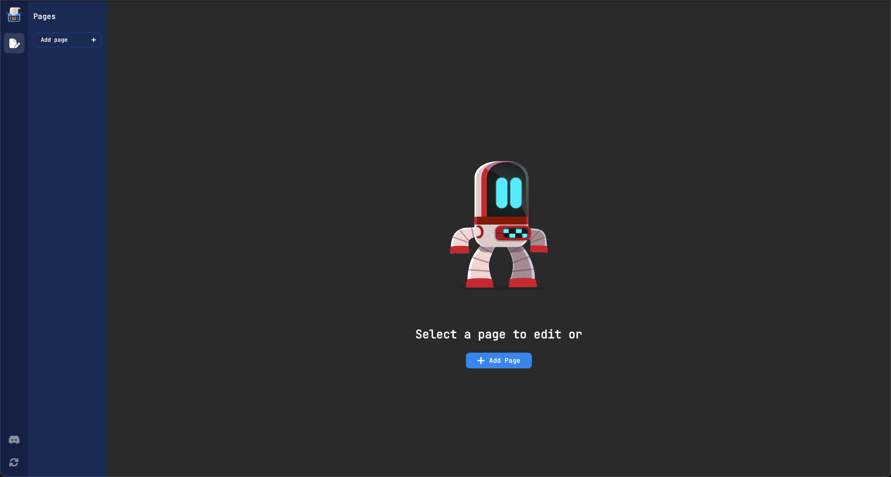
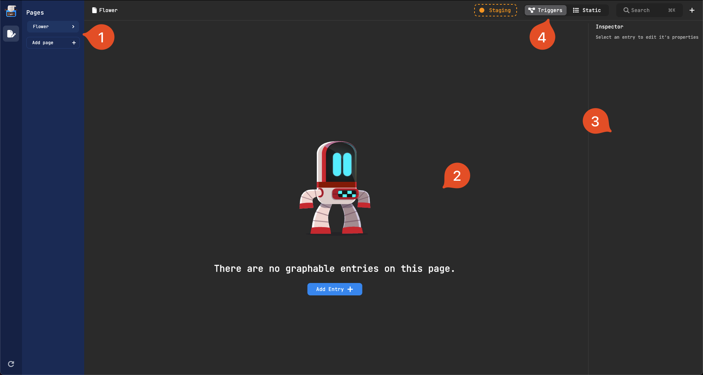
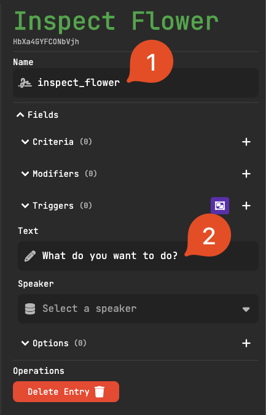
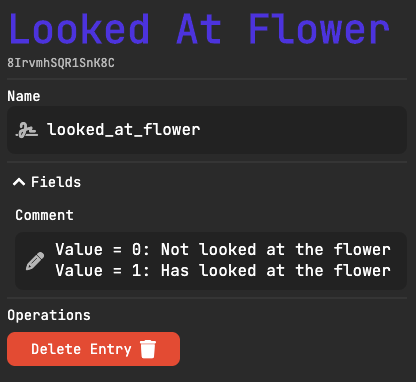
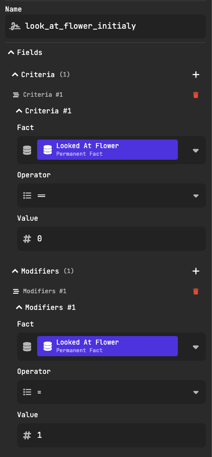
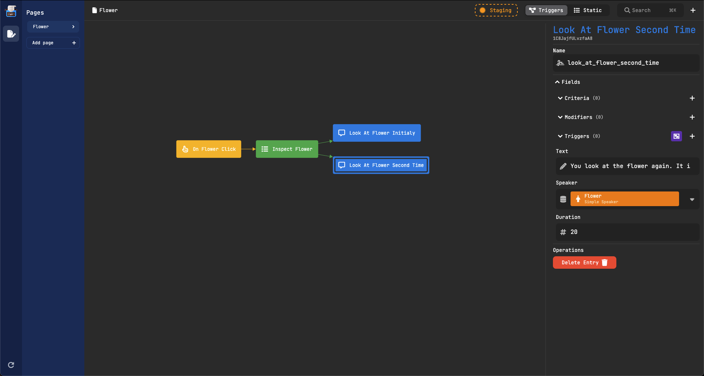
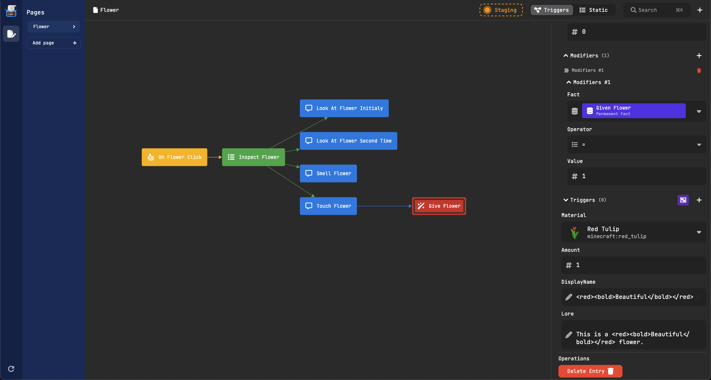

import Player from "@site/src/components/Player";

# First Interaction
:::danger[Outdated]
This section currently is outdated and maybe contains images/videos that are not in the latest release
:::

:::info[Basic Adapter required]
This guide uses the [Basic Adapter](../../adapters/BasicAdapter/BasicAdapter.mdx), hence it must be installed before following this guide.
:::

Let's create our first interaction. Our example interaction will look like this:

1. The player clicks on a flower.
2. A chat dialogue is opened, and the player is given two options.
   - Smelling the flower
   - Touching the flower
3. Both options lead to some dialogue. But some behavior changes depending on the option.
   - Smelling the flower will have different dialogue the second time.
   - Touching the flower will give the player a flower one time.

If at any point you get stuck, feel free to ask for help on our [Discord](https://discord.gg/HtbKyuDDBw).

## Opening the Web Panel

Before we begin creating our interaction, we need to open the web panel.
To do this, run `/typewriter connect` in game. Then clicking the link that is given to you.

:::caution
If you're getting a message along the lines of "The server is not hosting the websocket. Try enabling it in the config", please refer to [Configuring the Web Panel](../02-getting-started/01-installation.mdx#configuring-the-web-panel)
:::

This will give you a link to the web panel. Once you have opened the web panel, it should look something like
this:

## Creating a page

Pages in typewriter represent a self-contained unit of content. Pages can be used to create a story, or to
create a quest.

Let's create a page. To do this, click on the `Add Page` button. This will open a modal where you can create a
page. Pages need a name which is used to identify the page and must be unique. We will call our page `flower`.
Page names are written in `snake_case`, just like any other identifier in Typewriter.\
For now, we will leave the page type on `Sequence`.

<Player url={require("../assets/first-interaction/add-page.webm").default} />

## Panel layout

Let's have a look at everything that is on the panel.

1. **The page lists**: This is where you can see all the pages that you have created. You can also create new
   pages here.
2. **The graph editor**: This is where you can create the flow of your interaction. You can drag & zoom the
   graph editor to make it easier to work with.
3. **The inspector**: This is where you can edit the properties of the selected node. This is where the magic
   happens.
4. **The action bar**: There are multiple actions that we can click on. Let's check them out from left to right
   - **Staging indicator**: This indicates whether you have staging changes. If the indicator is orange, it means
     that you have changes that are not active on the server. When green, it means that the changes are active on the
     server. We will learn more about this [Here](#testing-the-interaction).
   - **Search bar**: This is where you can search for entries or create new ones. We will learn more about this
     [Here](#creating-first-entry).
   - **Add button**: This is where you can add new entries. This opens the search bar where you can create new
     entries.

## Creating first entry

Let's actually start working on the interaction. To do this, we need to create an entry. An entry is a single
unit of something. It can be a `dialogue`, an `event`, an `action`, or anything else.

Let's create an `event` entry that will be triggered when we click on a red tulip. To do this, click on the `+`
button in the action bar.
This will open the search bar.
The search bar is smart and can filter for specific actions such as creating a new entry.
To create the event, type `on interact with block`.
This will show you a list of entries that you can create.
Click on the `Add On Interact With Block` entry.
This will create a new `event` entry.

<Player
  url={require("../assets/first-interaction/create-event.webm").default}
/>

As you can see, the inspector auto selected the entry that we just created. In the inspector, there are several
things that we can change. Let's change the name of the entry to `on_flower_click`. We can also change the block
that we want to interact with. To do this, click on the `Block` field. This will open a modal where you can
select a block. Let's select the red tulip. After this the inspector should look like this:

## Creating an option

Currently, when we click on the red tulip, nothing happens. This is because there is no entry that gets
triggered when a player click on a red tulip. Let's change that. To do this, we need to create an `Option`. An
`Option` is a dialogue that allows the player to make a choice. Let's create an `Option` that will be shown when we click on the red
tulip. To do this, click on the `+` button in the action bar, and add an `option` entry.

Then change the name of the entry to `inspect_flower`. Then change the text of the option to `What do you want
to do?`. After this the inspector should look like this:

### Adding a speaker

Every dialogue needs a speaker. Speakers have a display name and can play a Minecraft sound when they are triggered.
Speakers are something called `static` entries. `Static` entries are entries that are not triggered by anything.
They are always active, and can be used to reference things.

To create static entries, we must make a special page called a `Static` page. Let's create a static page called `Flower Static`. Then, inside of it, create a `simple_speaker` which is the most
basic version of a speaker. Give it the name of `flower`, and let its display name be `<red><bold>Flower`.
This will make the display name of the speaker red and bold using the [Adventure Library](https://docs.adventure.kyori.net/minimessage/format.html).
It should look like this:

<Player
  url={require("../assets/first-interaction/create-speaker.webm").default}
/>

After that, we still need to go back to the `flower` page, and select the new speaker in
the `Inspect Flower` entry. To do this, click on the `Speaker` field. This will open a modal where you can select a speaker.
Select the `flower` speaker. It should look like this:

<Player
  url={require("../assets/first-interaction/select-speaker.webm").default}
/>

Now we only need to put in the different options that we want the player to be able to use. Click on the `+`
next to the options drop down to add a new option. Then change the text of the option to `Smell the flower`,
then add another option with the text `Touch the flower`. After this the inspector
should look like this:

## Connecting the entries

As you can see in the graph page, the entries are not yet connected. Entries can trigger next entries by
clicking on the purple selection next to the triggers field. This will put in a mode where you can select all
the entries that you want to trigger. When you are done you can click finish to connect them up. It should look
something like:

<Player
  url={require("../assets/first-interaction/connect-entries.webm").default}
/>

## Testing the interaction

To test our changes we need to publish them to the server. We can do this by hovering over the staging button

and clicking the publish button.

:::info Note
We do **not** have to restart the server. Publishing changes is instant and will be active immediately.
:::

If we now go in-game we will see the following when we click on a red tulip it will show us the two options:

<Player url={require("../assets/first-interaction/game-1.webm").default} />

## Smelling flower

### Adding dialogue

When the player wants to smell the flower, we want to display some dialogue. Try to add a `spoken` dialogue
entry. Rename it to `smell_flower_initially`, add the text `You smell the flower. It smells <blue><bold>fragrant</bold></blue>.`
select our `flower` speaker we created earlier, and finally specify a duration of `1s` for one second that the
message will be animated. Finally, connect the `smell_flower_initially` entry to the `inspect_flower` entry.

:::caution
It is important that you use the specific trigger from the correct option. The first `triggers` field are for
global triggers.
:::

When you publish the changes in the game, it should look something like this:

<Player url={require("../assets/first-interaction/game-2.webm").default} />

### Adding a conditional dialogue

Currently, every time we pick the `Smell the flower` option, we will get the same dialogue. This will get
boring very quickly. Let's fix it by introducing a new concept called `Facts`.

#### What are facts?

Facts are a way to store information for each player. Every fact is a separate entry and can only store one
number per player. When an entry gets triggered we can check if a player meets a certain criteria for a given
fact. Only if the player meets the criteria, will the entry get triggered. Then an entry can modify the same or different facts
for that player.

There are different types of facts. Each type of fact changes when a player "forgets" a fact. Aka when a player
logs out, after a certain amount of time, or never. When a player forgets a fact, the value of the fact will be
reset to the default value `0`.

#### Creating a fact

To create a fact, head over to a static page such as `Flower Static`, click on the `+` button in the action bar, and add a `permanent_fact` entry. Then change the name
of the entry to `smelled_flower`. We can add a comment describing the fact and how it is used. After this the
inspector should look like this:

#### Adding criteria to the dialogue

Now that we have created the fact we want to add a criterion to the dialogue. A criterion is a condition that
needs to be met for the dialogue to be triggered. To add a criterion, click on the `+` button next to the
criteria drop down. Then select the `smelled_flower` fact, and keep the rest the same. We also want to modify
this fact when the dialogue gets triggered. To do this, click on the `+` button next to the modifications drop
down. Then select the `smelled_flower` fact, make the modification `=` and the value `1`. After this the
inspector should look like this:

Now we can create a new `spoken` dialogue entry that will be triggered when the player smells the flower for
subsequent times. Rename it to `smell_flower_second_time`, add the text `You smell the flower again. It still smells <blue><bold>fragrant</bold></blue>.`, select our `flower` speaker we created earlier, and finally specify a
duration of `1s` that the message will be animated. Connect it to the `inspect_flower` entry as a trigger for
the `smell the flower` option.

:::tip
We actually don't need to set any criteria on the `smell_flower_second_time` dialogue entry. Typewriter picks the next
dialogue to be the dialogue by sorting all the next dialogue entries from most amount of criteria to least. Then picking the first one which has all the criteria met.
In this case `smell_flower_initialy` has one criterion, and `smell_flower_second_time` has none.

So `smell_flower_initialy` will be picked when the player has not smelled the flower.
:::

The UI should look something like this:

When you publish the changes. In the game it should look something like this:

<Player url={require("../assets/first-interaction/game-3.webm").default} />

## Adding additional dialogue

Now that we have added the first two dialogue entries, we can add the rest of the dialogue. We can add the
following dialogue entries:

- `touch_flower` - `You touch the flower. It feels <yellow><bold>soft</bold></yellow>`.

With the `touch_flower` you can add a `give_item` entry after it, which gives the player a `red_tulip`.
If you add another `fact` named `given_flower` and add a criterion & modifier to the `give_item` entry, you can
make it so that the player can only get the flower once.

If you are not able to make it work, try reading parts again or go to our
[Discord](https://discord.gg/HtbKyuDDBw) and ask for help.

Finally, the UI should look something like this:

When you publish the changes. In the game it should look something like this:

<Player url={require("../assets/first-interaction/game-4.webm").default} />

## Next steps

Now that you understand the basics of TypeWriter and have made your first interaction, it's time to spice up your interaction by adding a `cinematic`. Read the [Cinematics](./02-cinematics.mdx) guide to learn more!

If you have any questions, feel free to ask them in the [Discord](https://discord.gg/HtbKyuDDBw).
