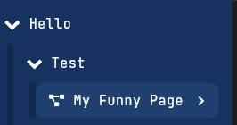

import Player from "@site/src/components/Player";

# Chapters

Chapters add a touch of convenience to your typewriter workflow, resembling the familiar structure of chapters in a book. Similar to files forming a folders on a pc, typewriter's chapter system organizes pages within chapters.

### Setting Chapters
Easily create a chapter by right-clicking on a page and selecting `Change Chapter`. Enter the desired chapter name and click `Change`.
<Player url={require("../assets/chapters/chapters.webm").default} />

### Setting Sub-Chapters
Creating sub-chapters is super simple. Simply use the main chapter name and add a `.` for example, `hello.test` will generate a sub-chapter. Like shown below:

Feel free to extend the story with as many sub-chapters as needed. For instance, `hello.test.morning` would work to. TypeWriter automatically collects pages with the same chapter name and groups them together.

