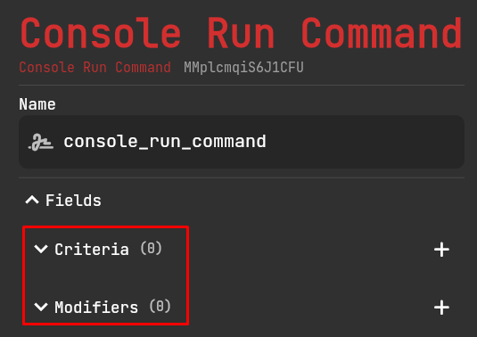
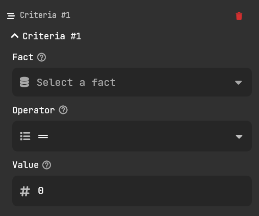

# Facts

Facts are essentially variables. They store information that can be modified by other entries. All facts are numbers, and are treated as so.

:::info
Facts are stored per player, not for the server or world, unless otherwise specified.
:::

The [Basic Adapter](../adapters/basic-adapter) has a few types of facts to use.

## Use

To create a fact, navigate to the `static` panel of any page. The button is at the top right near the publish button.

Once you are there, press the + and create any type of fact you would like. You may fill out the parameters as you wish.

To use the fact in your entries, head back to the `triggers` panel and select an action. You should see these fields:

Press the + on either of them to create an instance of that field.

### Criteria

The criteria field allows you to set a condition for an action before it is run. If the condition is false, the action will not be run.

Select your fact and choose an operator and number to check the value of the fact with. If the condition is met, then the action will run.

### Modifiers

The modifiers' field allows you to modify facts.

:::caution
Modifying facts will only run if the entry is run. If the entry is not run, the fact will not be modified.

Hence, if the entry has criteria, and the criteria is false, the fact will not be modified.
:::

Select your fact and the operator to use with the fact. You can choose to change the value directly (=) or add to it (+).
