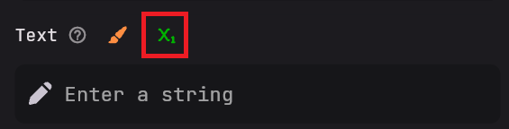

# PlaceHolderAPI

:::warning[plugin needed]
To follow this tutorial, you must have the [PlaceHolderAPI](https://www.spigotmc.org/resources/placeholderapi.6245/) installed.
:::

## Use PlaceHolderAPI's Placeholders

If you want to expand your story with PlaceHolderAPI's placeholders, you can do that by checking if the PlaceHolderAPI icon is placed above the text box (see image):

By just using the PlaceHolderAPI's format, you can make them work. For example, `%player_name%` would give the name of a player.

:::danger[Not working]
If placeholders are not working, make sure you have the placeholder installed. For instance, with `%player_name%`, you must have installed `player` via the PlaceHolderAPI ecloud. To do this, just run: `/papi ecloud install player`.
:::

## Use TypeWriter's Placeholders

TypeWriter provides two placeholders for use with the PlaceHolderAPI:

- `%typewriter_entryid%`
- `%typewriter_entryname%`

Both placeholders provide the same information, but you may choose to access them in different ways. It's generally recommended to use the entry ID for more reliable results, but the entry name is also an option.

To find the entry ID, refer to the following image:

Your placeholder for TypeWriter would be something like `%typewriter_W2X2ZbG0pzXGsS6%`.\
Than when calling the placeholder it checks the id and:

- if entry is a speaker it gives the display name back.
- if entry is a fact it gives the fact value back.
- if entry is a sound it gives the id of the minecraft sound.
